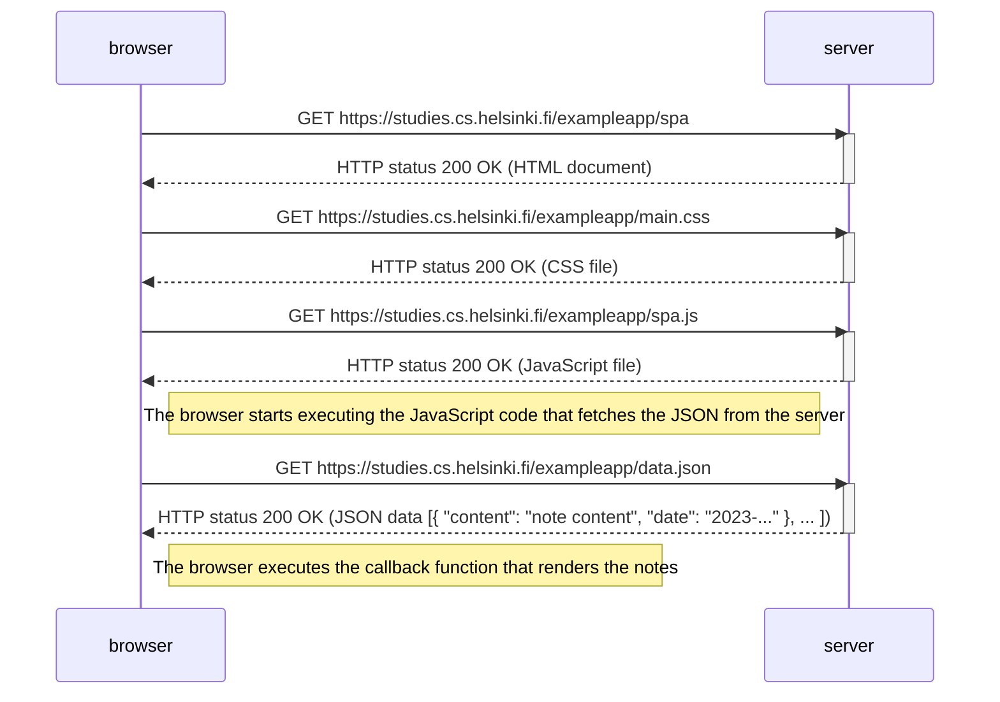
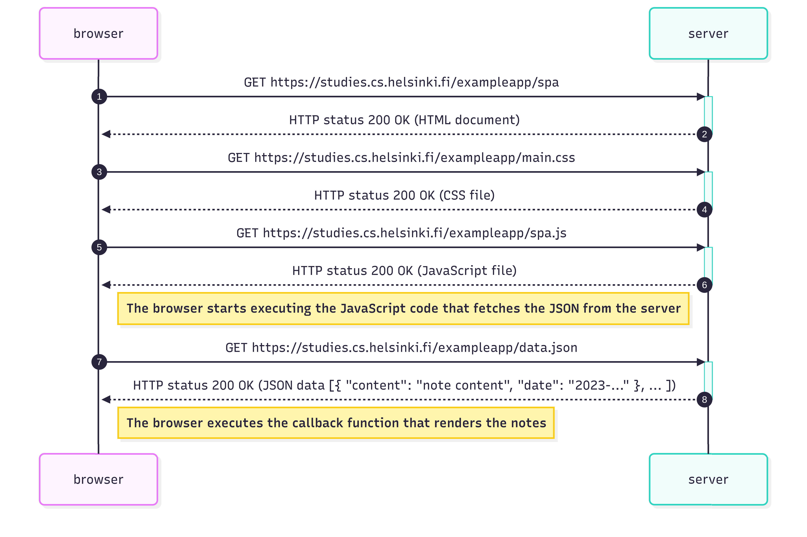

# 0.5: Single page app diagram

The browser fetches the initial HTML document, CSS file, and JavaScript file. Once the JavaScript executes, it automatically fetches the JSON data containing all the notes. The SPA is now fully loaded and interactive, allowing users to view and interact with notes without full page reloads.

