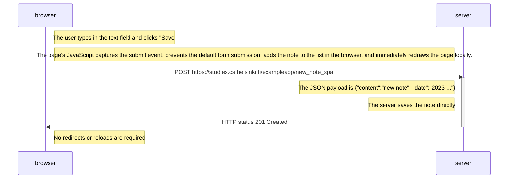
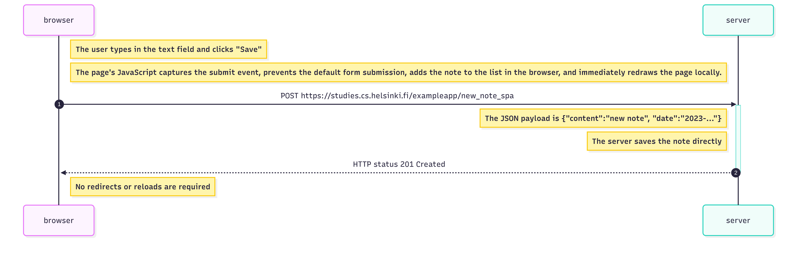

# 0.6: New note in Single page app diagram

This diagram represents the sequence of events that occurs when a user creates a new note using the single-page application version of the notes app.

The user types in the text field and clicks the Save button. Unlike the traditional application, the JavaScript code intercepts the form submission, prevents the default browser behavior, immediately adds the note to the list in the browser, and redraws the page locally. The browser then sends the new note data to the server via a POST request. The server saves the note and returns a 201 Created status code. Since the note was already displayed in the UI before the server confirmation, no page reload or redirect is necessary.

