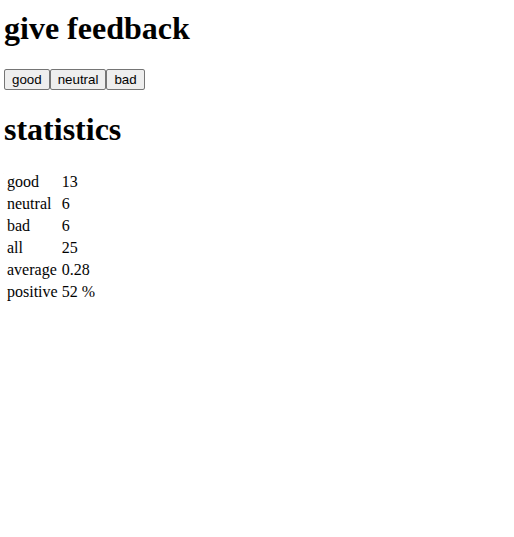

# Part 1: Working Ground — Summary

## Overview
First part of the Full Stack Open course. Introduces React with Vite, components, props, local state (useState), and immutability. Three small applications built sequentially.

---

## Application 1: Course Information

**Objective**: Refactor a monolithic component into hierarchical components.

**Technologies**: React, Vite, components, props.

**Requirements**:
- Divide `App` into `Header`, `Content`, `Total`
- `Content` must render three `Part` components
- Step 1.3: use JavaScript objects for `part1`, `part2`, `part3`
- Step 1.4: group parts into array `parts` and pass it as prop
- Step 1.5: unify everything into a `course` object with `name` and `parts` fields

**Status**: COMPLETED

**Key Files**: `App.jsx` (components defined in the same file, no extra CSS).

---

## Application 2: Unicafe

**Objective**: Manage local state with `useState` and calculate statistics.

**Technologies**: React, useState, conditional rendering, HTML tables.

**Requirements**:
- State: `good`, `neutral`, `bad` (initialized to 0)
- Three buttons that increment each counter
- Calculate: total votes, average (good=1, neutral=0, bad=-1), positive percentage
- Extract `Statistics` component (calculation logic)
- Show "No feedback given" if no votes (conditional)
- Extract reusable components: `Button` and `StatisticLine`
- Display statistics in an HTML table (`<table>`)
- No warnings in console

**Status**: COMPLETED

**Notes**: Golden rule — do not mutate state directly, use spread or immutable methods.

---

## Application 3: Anecdotes

**Objective**: Handle immutable arrays, voting, and maximum calculation.

**Technologies**: React, useState, Math.random, arrays.

**Requirements**:
- Array of anecdotes (strings) as initial data
- "next" button that shows a random anecdote (Math.random)
- State: `votes` array (same length as anecdotes), initialized to zeros
- "vote" button that increments the vote for the current anecdote (immutable: copy array)
- Display vote count next to each anecdote
- Calculate and display the anecdote with the most votes (separate section)

**Status**: COMPLETED

**Notes**: Immutability critical — use `[...votes]`, `votes.concat()`, or `map()`.

---

## Transversal Themes Part 1
- **Golden Rules**:
  1. Keep browser console open always
  2. Do not mutate state (use copies)
  3. Pass function references (do not invoke in JSX)
  4. State in React is asynchronous

- **Tools**: Vite, React Developer Tools extension.

---

## Applications in Action

### Anecdote of the Day

*Random selection of anecdotes with an interactive voting system.*

### Half Stack Application Development

*Visualization of the complete Full Stack concept in the course context.*

### Uni Cafe

*Feedback visualization*
