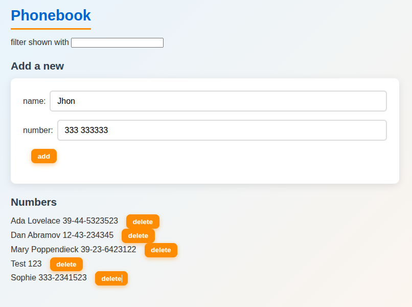
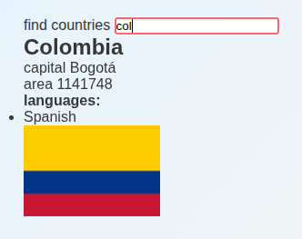

# Part 2: Rendering Collections, Forms and API — Summary

## Overview
Second part: mastering rendering lists (arrays), controlled/uncontrolled forms, and backend communication via axios. Introduces JSON Server as a mock backend.

---

## Application 1: Extended Course Information

**Objective**: Support multiple courses and use array methods.

**Technologies**: React, props, array methods (reduce), ES6 modules.

**Requirements**:
- Change data: `course` with `id`, `name`, `parts[]` (each part with `id`)
- Create `Course` component as a separate module
- Display total sum of exercises with `reduce()`
- Support multiple courses: array `courses[]`, render each one
- Modularize subcomponents (Header, Content, Part, Total) in separate files

**Status**: COMPLETED

---

## Application 2: Phonebook (frontend)

**Objective**: Complete CRUD frontend with forms, validation, and search.

**Technologies**: React, useState, controlled forms, axios, JSON Server.

**Requirements**:

### Phase 1 – Pure Frontend (ex. 2.6–2.10)
- State: `persons` (array of `{name, number, id}`), `newName`, `newNumber`
- Form with two controlled inputs + submit button
- Prevent default action of the form
- Validate duplicate name when adding → `alert('already added')`
- Search: external input to the form that filters `persons` (case-insensitive)
- Extract components:
  - `Filter` (search input)
  - `PersonForm` (add form)
  - `Persons` (list of persons)
  - `Person` (individual row)

### Phase 2 – Backend with JSON Server (ex. 2.11)
- `db.json` with initial person data
- Start server: `json-server --port 3001 db.json`
- GET `/api/persons` with axios in `useEffect`
- CORS enabled in backend

### Phase 3 – Complete CRUD (ex. 2.12–2.15*)
- POST person → `axios.post('/api/persons', person)`
- DELETE person → `axios.delete('/api/persons/' + id)`, confirm with `window.confirm`
- PUT: if name already exists, update number (replace)
- Handle HTTP 404 errors in promises → notification in UI
- Success/error notifications that disappear after 5 seconds

**Status**: COMPLETED

**Notes**: Do not use `delete` as a variable (reserved word). Use template strings.

---

## Application 3: Countries + Weather

**Objective**: Consume two external APIs (REST Countries + OpenWeatherMap).

**Technologies**: Fetch API (or axios), Vite environment variables, conditional state handling.

**Requirements**:

### Exercise 2.18* – Countries
- Search input → GET `https://studies.cs.helsinki.fi/restcountries/name/{query}`
- If response >10 countries → message "More than 10 matches, be more specific"
- If 2–10 countries → list of names, each with "show" button
- If 1 country → display: flag, capital, area, languages
- Ignore edge cases like "Sudan" vs "South Sudan"

### Exercise 2.19* – Individual View
- "show" button per country → navigate to detail view
- Detail view shows all attributes + flag

### Exercise 2.20* – Weather
- Display weather of the capital
- API: OpenWeatherMap → `https://api.openweathermap.org/data/2.5/weather?q={capital}&appid={key}`
- API key stored in environment variable: `VITE_WEATHER_API_KEY`
- Access: `import.meta.env.VITE_WEATHER_API_KEY`
- Display weather icons (according to OpenWeatherMap docs)

**Status**: COMPLETED

**Notes**:
- API key MUST NOT be committed → use `.env` or export in terminal
- In Firefox may fail if API uses http instead of https → use Chrome
- Vite proxy if CORS issues

---

## Transversal Themes Part 2
- **Controlled forms**: value + onChange vs uncontrolled
- **Immutability**: spread operator `[...arr]`, `concat()`
- **Axios**: GET, POST, PUT, DELETE
- **JSON Server**: quick mock REST API
- **Vite proxy**: `vite.config.js` → `proxy: { '/api': 'http://localhost:3001' }` to avoid CORS in development
- **React DevTools**: inspect state in browser

---

## Environment Variable

VITE_SOME_KEY=your_openweathermap_api_key_here

---

## Applications in Action

### Course Information

*Summary of the Full Stack curriculum with breakdown of topics and exercises per section.*

### Phonebook

*Phonebook with complete CRUD, search, and persistence in JSON Server.*

### Countries + Weather

*Country explorer with detailed information and real-time weather.*

---
