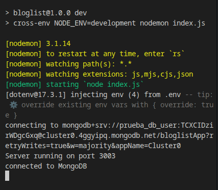

# Part 4: Backend Structure and Testing — Summary

## Overview
Fourth part: refactors the backend into modules, introduces unit testing (Node test) and integration testing (SuperTest), and implements JWT authentication with bcrypt.

---

## Application 1: Bloglist Backend

**Objective**: REST API for blogs with Mongoose + modular structure + testing.

**Technologies**: Express, Mongoose, SuperTest, JWT, bcrypt, token-based auth.

**Requirements**:

### Exercise 4.1–4.2 – Basic Setup and Modularization
- Express + CORS + `express.json()`
- Blog Schema: `{ title: String, author: String, url: String, likes: Number, user: { type: mongoose.Schema.Types.ObjectId, ref: 'User' } }`
- GET `/api/blogs` → returns JSON array (complete)
- POST `/api/blogs` → creates blog, status 201
- `toJSON` transform in schema to convert `_id` → `id`
- Refactor into modules:
  - `models/blog.js`
  - `controllers/blogs.js`
  - `routers/blogs.js`
  - `app.js` (middleware and route configuration)
- Configure test environment with separate database (`bloglist_test`)

### Exercise 4.3–4.7 – Utils + Unit Tests
- File `utils/list_helper.js` with functions:
  - `dummy(blogs)` → always returns 1
  - `totalLikes(blogs)` → sum of `likes`
  - `favoriteBlog(blogs)` → object `{ title, author, likes }` of blog with most likes
  - `mostBlogs(blogs)` → `{ author, blogs }` (author with most blogs)
  - `mostLikes(blogs)` → `{ author, likes }` (author with most accumulated likes)
- Tests with `node:test` module and `assert`:
  - Use `deepStrictEqual` to compare objects
  - `describe` blocks to group tests
  - `deep-freeze` to ensure immutability in tests

### Exercise 4.8–4.12 – SuperTest (Integration Tests)
- Test GET `/api/blogs`: verify number of blogs returned
- Refactor controllers to `async/await`
- Test: `id` field exists (not `_id`) → `toJSON` in schema
- Test POST: total blogs increases by 1
- Test POST without `likes`: `likes` defaults to 0
- Test POST without `title` or `url`: status 400 Bad Request

### Exercise 4.13–4.14 – DELETE and PUT
- DELETE `/api/blogs/:id`: delete blog, async/await, associated test
- PUT `/api/blogs/:id`: update (mainly `likes`), test

### Exercise 4.15–4.23 – JWT Authentication

#### Step 1: Create Users (4.15)
- POST `/api/users` → `{ username, password, name }`
- Password hashed with bcrypt (`bcrypt.hash()`)
- GET `/api/users` → list users (without passwords)

#### Step 2: User Validations (4.16*)
- `username` and `password` ≥ 3 characters
- `username` unique in DB
- Validations in controller (before bcrypt) → 400 + message
- Tests for creating invalid user (status 400)

#### Step 3: User-Blog Relationship (4.17)
- Blog Schema: `user` ref to User
- POST blog → assign `user` (e.g., first user found)
- Populate: GET `/api/blogs` includes user data (`populate('user')`)
- GET `/api/users` includes created `blogs` (`populate('blogs')`)

#### Step 4: Login + JWT (4.18)
- POST `/api/login` → `{ username, password }`
- Verify password with `bcrypt.compare()`
- If correct → generate token with `jsonwebtoken`: `jwt.sign({ username, id: user._id }, SECRET)`
- Return `{ token, username, name }` (NO password)

#### Step 5: tokenExtractor Middleware (4.20*)
- Middleware extracts token from header `Authorization: bearer <token>`
- Assigns to `request.token`
- Registered before protected routes: `app.use(middleware.tokenExtractor)`

#### Step 6: userExtractor Middleware (4.22*)
- Decodes token with `jwt.verify(request.token, SECRET)`
- Finds user in DB → `request.user`
- Registered for specific routes: `app.use('/api/blogs', middleware.userExtractor, blogsRouter)`

#### Step 7: Operation Protection (4.21*, 4.23*)
- POST blog → only with valid token (`request.user` exists)
- DELETE blog → only creator can delete:
  ```js
  if (blog.user.toString() !== request.user.id.toString()) {
    return response.status(401).json({ error: 'unauthorized' })
  }
  ```
- Tests: POST without token → 401 Unauthorized

**Module Structure**:
```
backend/
├── app.js                     # Express app + middlewares
├── models/
│   ├── blog.js               # schema + toJSON
│   └── user.js               # schema + bcrypt pre-save hook
├── controllers/
│   ├── blogs.js              # get, create, update, delete
│   └── users.js              # create, find all, login
├── routers/
│   ├── blogs.js
│   └── users.js
├── middleware/
│   ├── tokenExtractor.js
│   └── userExtractor.js
├── utils/
│   └── list_helper.js        # business logic (unit tests)
├── tests/
│   ├── blog_api.test.js
│   └── user_api.test.js
├── .env                       # MONGODB_URI, SECRET
└── package.json
```

**Status**: COMPLETED

---

## Transversal Themes Part 4
- **Testing**:
  - Unit tests: pure logic (list_helper) → `node:test`
  - Integration tests: API endpoints → SuperTest
  - Separate test environment (DB `bloglist_test`)
- **Mongoose**:
  - `populate()` for references
  - `toJSON` transform for `_id` → `id`
  - Validations at schema and controller level
- **JWT**: header `Authorization: Bearer <token>`, verification with `jwt.verify()`
- **bcrypt**: `hash()` (create), `compare()` (verify)
- **Middleware ordering**: `app.use(middleware)` before `app.use('/api', router)`
- **Error handling**: `next(error)`, middleware with 4 parameters

---

## Applications in Action

### Bloglist Backend


*Complete REST API with JWT authentication, MongoDB, unit and integration testing.*

---
