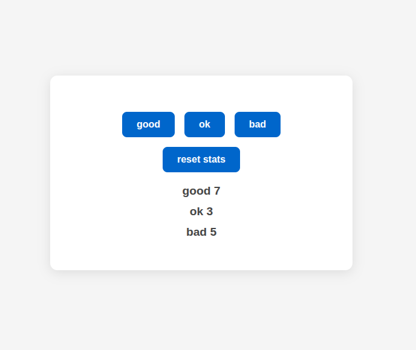
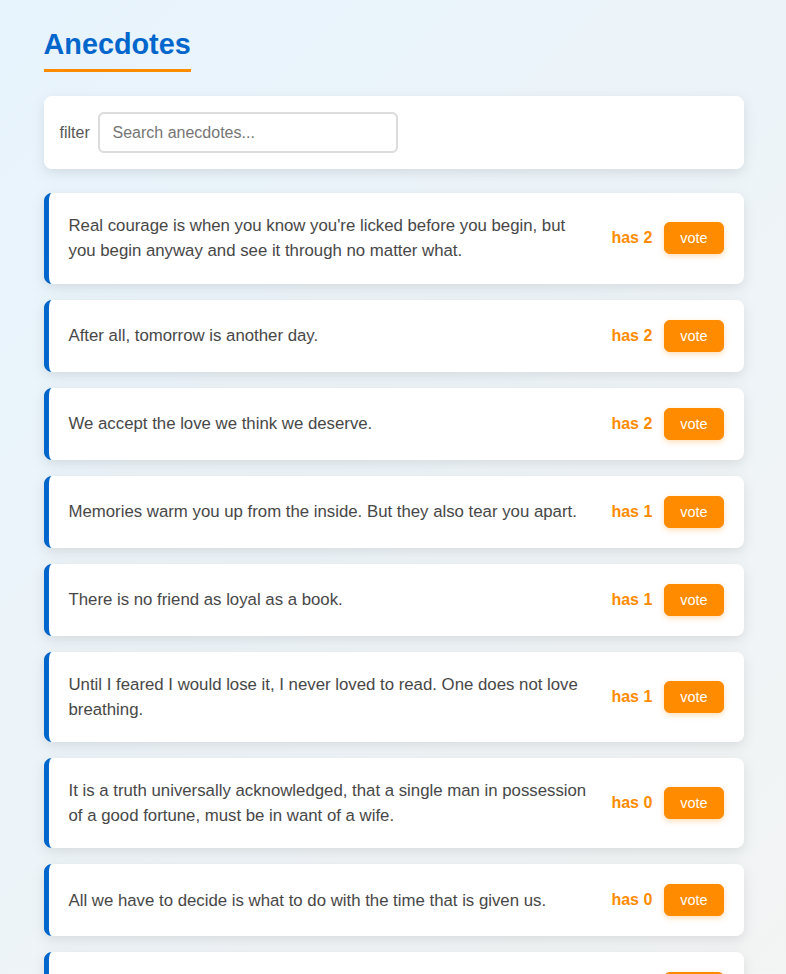

# Part 6: Global State Management (Redux, Redux Toolkit, React Query) — Summary

## Overview
Sixth part: explores three approaches for global state management:
1. **Pure Redux** (no Toolkit) — pure reducer, action creators, combineReducers
2. **Redux Toolkit (RTK)** — createSlice, configureStore, implicit immutability
3. **React Query + Context API** — server state data fetching, useReducer for UI state

Works on three variants of the Anecdotes app and one Unicafe app.

---

## Application 1: Unicafe with Pure Redux

**Objective**: Implement Unicafe using "classic" Redux.

**Technologies**: Redux, react-redux, deep-freeze, Vitest/node:test.

**Requirements**:

### Exercise 6.1 – Reducer + Tests
- Initial state: `{ good: 0, ok: 0, bad: 0 }`
- Actions: `GOOD`, `OK`, `BAD`, `ZERO`
- Pure reducer: switch-case, returns new state (immutable)
- Tests:
  - Call with `undefined` → returns initial state
  - `GOOD` → `good` increments by 1
  - Use `deepFreeze(state)` to ensure immutability in tests

### Exercise 6.2 – UI with React-Redux
- Store: `createStore(counterReducer)`
- Wrap app in `<Provider store={store}>`
- Components consume state with `useSelector`:
  - `Statistics` → `state.good`, `state.ok`, `state.bad`
- Buttons dispatch actions with `useDispatch`: `dispatch({ type: 'GOOD' })`

**Status**: COMPLETED

**Structure**:
```
src/
├── store.js
├── reducers/
│   └── counterReducer.js
├── components/
│   ├── Button.jsx
│   └── Statistics.jsx
└── tests/
    └── reducer.test.js
```

---

## Application 2: Anecdotes with Pure Redux

**Objective**: Complete CRUD (create, vote, list) with Redux + combineReducers.

**Technologies**: Redux, react-redux, array methods.

**Requirements**:

### Exercise 6.3 – Vote
- State: `anecdotes[]` (each anecdote: `{ id, content, votes }`)
- Action `VOTE` → finds anecdote by id, increments `votes` (immutable)
- Vote button per anecdote

### Exercise 6.4 – Create Anecdote
- Action `NEW_ANECDOTE` → add to beginning of array
- Controlled form (text input, submit button)

### Exercise 6.5 – Sort
- Sort array by `votes` descending before rendering
- `[...anecdotes].sort((a,b) => b.votes - a.votes)`

### Exercise 6.6 – Action Creators
- Move action creation to functions in separate file:
  - `voteAnecdote(id)`
  - `createAnecdote(content)`

### Exercise 6.7 – `AnecdoteForm` Component
- Separate form into its own component
- Form local state inside `AnecdoteForm`
- Dispatch `createAnecdote` on submit

### Exercise 6.8 – `AnecdoteList` Component
- Separate list into `AnecdoteList.jsx`
- Move voting logic here
- `App.jsx` only renders `<AnecdoteList />` and `<AnecdoteForm />`

### Exercise 6.9 – Filtering (combineReducers)
- New `filterReducer`:
  - State: `filter` (empty string)
  - Action `SET_FILTER` → `state = action.payload`
- `Filter` component (input) → dispatch `setFilter(event.target.value)`
- Store: `combineReducers({ anecdotes, filter })`
- Filtered list: `anecdotes.filter(a => a.content.includes(filter))`

**Status**: COMPLETED

---

## Application 3: Anecdotes with Redux Toolkit (RTK)

**Objective**: Migrate to modern Redux Toolkit + notifications.

**Technologies**: @reduxjs/toolkit, createSlice, configureStore, Redux DevTools.

**Requirements**:

### Exercise 6.10 – Configure Store with RTK
- Install `@reduxjs/toolkit`
- `store.js`: `configureStore({ reducer: combineReducers(...) })`
- DevTools enabled automatically
- `filterReducer` → `createSlice({ name: 'filter', initialState: '', reducers: { setFilter: (state, action) => action.payload } })`

### Exercise 6.11 – Anecdote Slice
- `anecdoteSlice = createSlice({
    name: 'anecdotes',
    initialState: [],
    reducers: {
      addAnecdote: (state, action) => { state.push(action.payload) },
      voteAnecdote: (state, action) => {
        const a = state.find(a => a.id === action.payload)
        if (a) a.votes++
      }
    }
  })`
- Note: RTK uses Immer, mutation "allowed" internally
- Sort: `state.sort((a,b) => b.votes - a.votes)` does NOT mutate directly → use copy: `[...state].sort()` before assigning

### Exercise 6.12 – Notification Slice
- `notificationSlice`:
  ```js
  initialState: '',
  reducers: {
    setNotification: (state, action) => action.payload,
    clearNotification: () => ''
  }
  ```
- `Notification` component with `useSelector(state => state.notification)`
- Render notification if not empty

### Exercise 6.13 – Ephemeral Notifications
- In vote/create actions: dispatch `setNotification(...)` + `setTimeout` to `clearNotification`
- Improvement: action `setNotification(message, seconds=5)` that internally creates the timeout

**Status**: COMPLETED

---

## Application 4: Redux Async (Thunk) + Backend Json-Server

**Objective**: Connect Redux to REST backend with async action creators (thunks).

**Technologies**: redux-thunk (included in RTK), json-server, fetch API.

**Requirements**:

### Setup Backend
- `json-server` with `server.js` (port 3005)
- `db.json` with initial anecdote data
- Script `npm run server`

### Exercise 6.14 – Load Anecdotes (Thunk)
- Thunk `initializeAnecdotes()`:
  ```js
  export const initializeAnecdotes = () => async dispatch => {
    const response = await fetch('/api/anecdotes')
    const data = await response.json()
    dispatch(setAnecdotes(data))
  }
  ```
- Call in `useEffect` of `App.jsx`

### Exercise 6.15 – Create Anecdote (Thunk)
- Thunk `createAnecdote(content)`:
  - POST `/api/anecdotes`
  - Dispatch `addAnecdote` with result
  - Dispatch notification

### Exercise 6.16 – Configure Thunks
- RTK already includes thunk by default
- If pure Redux: `applyMiddleware(thunk)` in `createStore`

### Exercise 6.17 – Create with Thunk in UI
- `AnecdoteForm` dispatches `createAnecdote(content)` directly

### Exercise 6.18 – Vote with Thunk
- Thunk `voteAnecdote(id)`:
  - GET current anecdote
  - Increment `votes`
  - PUT `/api/anecdotes/:id` with all fields
  - Dispatch `voteAnecdote` with server response

### Exercise 6.19 – Parameterized Notification
- Action `setNotification(message, seconds)` that includes `setTimeout` internally
- Usage: `dispatch(setNotification('voted!', 10))`

**Status**: COMPLETED

**Structure**:
```
src/
├── store.js                 # configureStore
├── reducers/
│   ├── anecdotesSlice.js
│   ├── filterSlice.js
│   └── notificationSlice.js
├── services/
│   └── anecdoteService.js   # fetch wrappers
├── components/
│   ├── AnecdoteList.jsx
│   └── AnecdoteForm.jsx
└── App.jsx
```

---

## Application 5: React Query + Context API

**Objective**: Modern alternative: React Query for data fetching, Context for UI state (notifications).

**Technologies**: @tanstack/react-query, useReducer, createContext, useContext.

**Requirements**:

### Exercise 6.20 – Load Anecdotes with useQuery
- Clone base: `query-anecdotes`
- Configure `QueryClientProvider` at root
- Custom hook or direct in component:
  ```js
  const { data: anecdotes, error, isLoading } = useQuery({
    queryKey: ['anecdotes'],
    queryFn: fetchAnecdotes,
    retry: false
  })
  ```
- Conditional rendering:
  - `isLoading` → spinner
  - `error` → message "Anecdote service unavailable"
  - `anecdotes` → list

### Exercise 6.21 – Create with useMutation
- `const mutation = useMutation({ mutationFn: postAnecdote, onSuccess: () => queryClient.invalidateQueries(['anecdotes']) })`
- Form: `mutation.mutate({ content })`
- Frontend validation: minimum 5 characters

### Exercise 6.22 – Vote with useMutation
- `useMutation` for PUT `/api/anecdotes/:id`
- `onSuccess`: invalidate queries or manually update cache

### Exercise 6.23 – Notifications with Context
- `NotificationContext.jsx`:
  ```js
  const NotificationContext = createContext()
  const [notification, dispatch] = useReducer(notificationReducer, '')
  ```
- Provider in `App.jsx`
- Hook `useNotification()` to consume
- `Notification` component reads from context
- Actions: `SET_NOTIFICATION`, `CLEAR_NOTIFICATION` (with 5s timeout)

### Exercise 6.24 – Error Handling
- If POST fails (e.g., content <5 chars): catch error
- Dispatch `setNotification('Error: ' + error.message, 5)` with red style

**Status**: COMPLETED

**Structure**:
```
src/
├── contexts/
│   └── NotificationContext.jsx
├── hooks/
│   └── useAnecdotes.js   # encapsulates useQuery/useMutation
├── services/
│   └── anecdoteService.js
├── components/
│   ├── AnecdoteList.jsx
│   └── CreateAnecdoteForm.jsx
└── App.jsx
```

---

## Application 6: Country Hook

**Objective**: Custom hook for searching countries.

**Requirements** (Ex. 2.18–2.20 applied here with hook):
- Clone `country-hook`
- Hook `useCountry(name)`:
  - `useEffect` with `name` as dependency
  - GET to `https://studies.cs.helsinki.fi/restcountries/name/${name}`
  - State: `country` (null or object)
  - Return `country`
- Main view: input → `useCountry` → show data or "not found"

**Status**: COMPLETED

---

## Application 7: Ultimate Hooks

**Objective**: Generic `useResource` hook for CRUD of any entity.

**Requirements** (Ex. 7.8):
- Clone `ultimate-hooks`
- Hook `useResource(baseUrl)`:
  - Returns `[resources, service]`
  - `service = { getAll, create }`
  - Internally uses fetch, updates state
- Use for multiple resources:
  - `const [notes, noteService] = useResource('/api/notes')`
  - `const [persons, personService] = useResource('/api/persons')`

**Status**: COMPLETED

---

## Summary of Approaches

| Characteristic | Pure Redux | Redux Toolkit | React Query + Context |
|----------------|------------|---------------|----------------------|
| **State management** | Manual store | RTK store | React Query (server) + Context (UI) |
| **Mutations** | Manual immutable | Immer (auto) | Cache invalidation |
| **Async** | Thunks | Thunks (built-in) | useMutation |
| **Boilerplate** | High | Low | Very low |
| **DevTools** | Manual | Automatic | Query DevTools |
| **Recommended use** | Theoretical understanding | Modern production | Apps with heavy data fetching |

---

## Useful Commands
```bash
# Redux
npm install @reduxjs/toolkit react-redux
npm run dev

# React Query
npm install @tanstack/react-query
npm run dev

# Tests
npm test                              
npx playwright test                   
```

---

## Applications in Action

### Unicafe


*Feedback collection application with real-time statistics.*

### Redux Anecdotes


*Anecdotes app with Redux for centralized state management.*

### React Query Anecdotes


*Anecdotes with React Query for efficient server-side data handling.*

---
